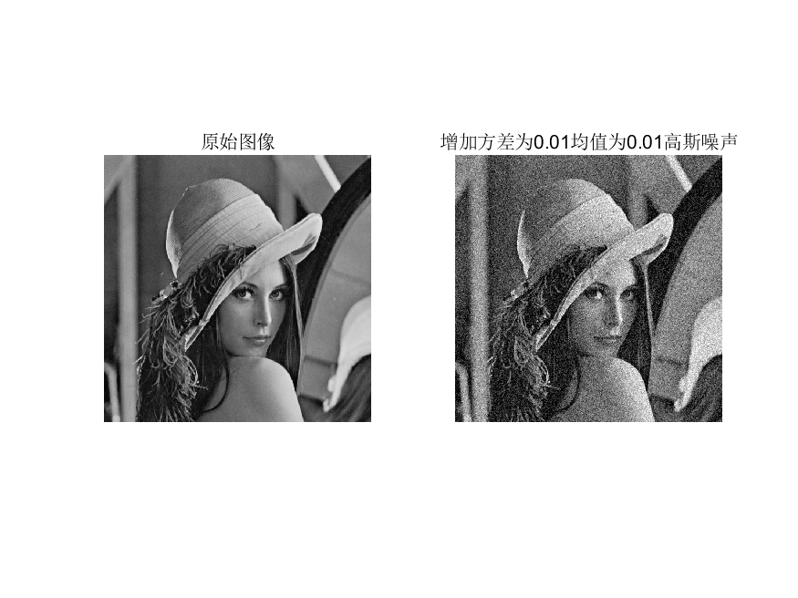
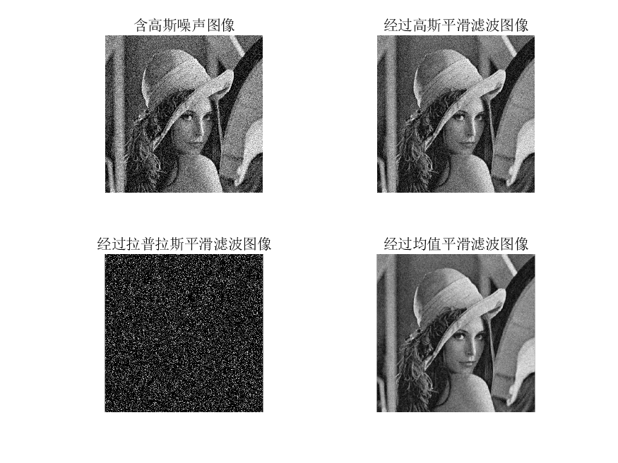
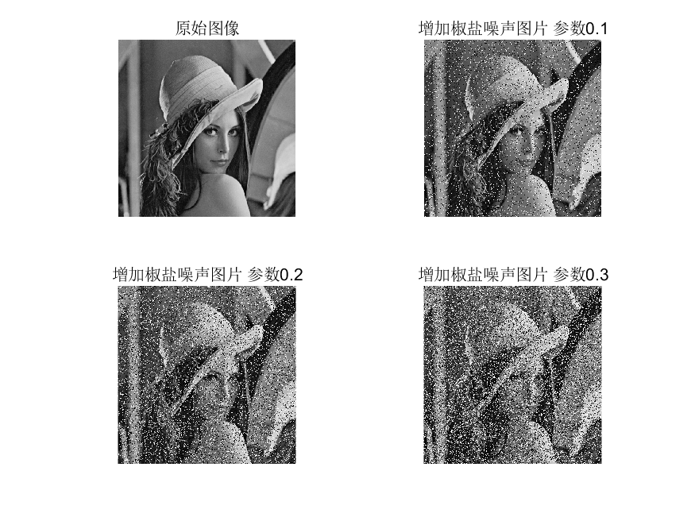
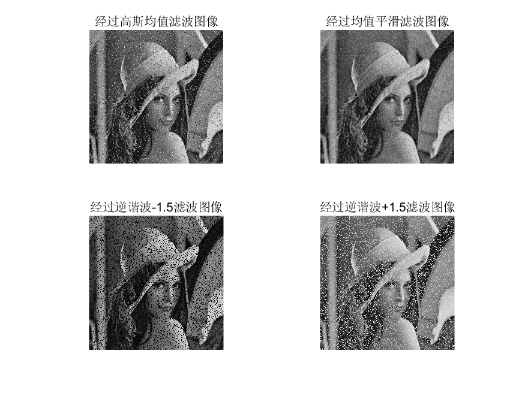
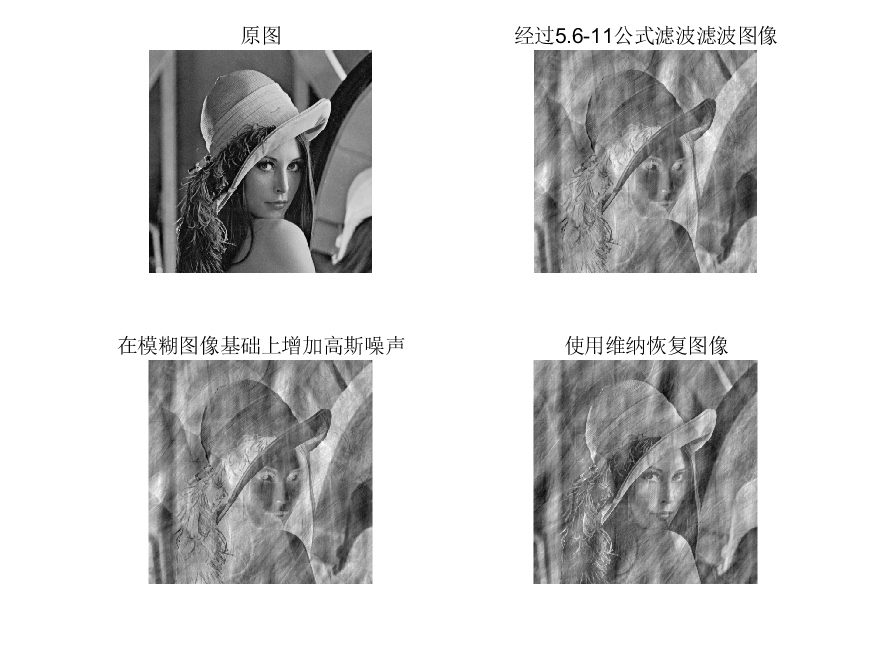
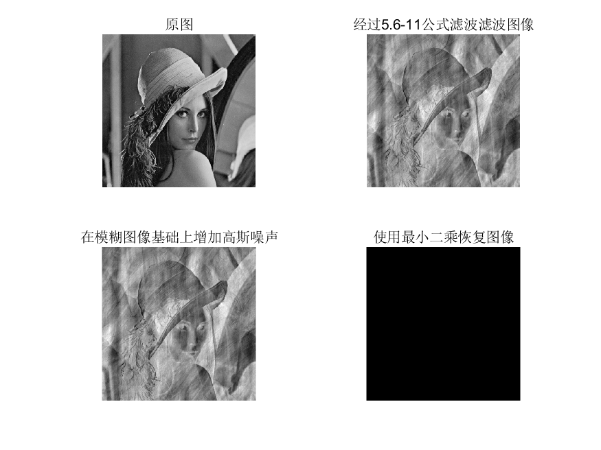

# 		数字图像处理第六次作业

 

 

**摘要：**
本次主要是对经过模糊处理以及添加噪声后的图像，进行恢复，采用多种滤波器对高斯噪声，椒盐噪声进行细致处理，处理结果比较理想。用维纳滤波器以及约束最小二乘滤波选择合理系数可以得到较好的结果对原图实现恢复。

 

​      

 

 

 

**姓名：赵毅**    

**班级：自动化64** 

**学号：2160504108**

**提交日期：2019/4/1**

【题目分析】

1. 在测试图像上产生高斯噪声lena图-需能指定均值和方差；并用多种滤波器恢复图像，分析各自优缺点；

利用matlab函数进行高斯噪声的添加，高斯噪声的添加实际是将均值方差指定的高斯函数与所给图像进行叠加，从而人工模拟高斯噪声的添加。

matlab中imnoise函数可以实现该功能。本题中选用高斯平滑滤波器，以及拉普拉斯平滑滤波器对噪声图像进行处理。

经过高斯噪声添加后图片上出现大量噪点，平滑度降低。

选取三种平滑滤波器对图片进行处理，经过均值滤波的图像效果最好，经过拉普拉斯算子进行的滤波，效果极差，丢失大量信息。高斯平滑滤波的效果随着参数的调整的发生改变。

​       2.在测试图像lena图加入椒盐噪声（椒和盐噪声密度均是0.1）；用学过的滤波器恢复图像；在使用反谐波分析Q大于0和小于0的作用；

添加不同数量椒盐噪声后图片如下所示

 对参数为0.1的图片进行多种滤波器滤波

经过四种滤波器后图片树上所示，其中经过均值平滑滤波器的效果最好，利用逆谐波滤波器可以针对性滤除胡椒噪声或者盐噪声。Q=0时 ，逆谐波均值滤波器简化为算数均值滤波器，Q=-1为谐波均值滤波器。Q为正能够消除胡椒噪声，Q为负能够消除盐噪声。

3.推导维纳滤波器并实现下边要求；

(a) 实现模糊滤波器如方程Eq. (5.6-11).

(b) 模糊lena图像：45度方向，T=1；

(c) 再模糊的lena图像中增加高斯噪声，均值= 0 ，方差=10 pixels 以产生模糊图像；

(d)分别利用方程 Eq. (5.8-6)和(5.9-4)，恢复图像；并分析算法的优缺点.

建立函数将图像模糊设置参数 T=1;a=2;b=2;

图像如下所示对，该图像增加高斯噪声后如上所示

利用公式还原图像，

使用维纳滤波器的效果优于最小二乘，由于某种原因最小二乘的图像出现了问题。

clc;
clear;
m=0.01;var1=0.01;
pi1=imread('lena.bmp');
po1=imnoise(pi1,'gaussian',m,var1);
figure;
subplot(1,2,1)
imshow(pi1)
title('原始图像');
subplot(1,2,2)
imshow(po1)
title(['增加方差为',num2str(m),'均值为',num2str(var1),'高斯噪声']);
% saveas(gcf,'1.png')

w1=fspecial('gaussian');%高斯平滑滤波
po2=imfilter(po1,w1);

w2=fspecial('laplacian');
po3=imfilter(po1,w2);

w3=fspecial('average');
po4=imfilter(po1,w3);

figure;
subplot(2,2,1)
imshow(po1)
title('含高斯噪声图像');

subplot(2,2,2)
imshow(po2)
title('经过高斯平滑滤波图像');

subplot(2,2,3)
imshow(po3)
title('经过拉普拉斯平滑滤波图像');

subplot(2,2,4)
imshow(po4)
title('经过均值平滑滤波图像');

% saveas(gcf,'2.png')

clc;
clear;
m=0.01;var1=0.01;
pi1=imread('lena.bmp');
px1=imnoise(pi1,'salt & pepper',0.1);
px2=imnoise(pi1,'salt & pepper',0.2);
px3=imnoise(pi1,'salt & pepper',0.3);
figure;
subplot(2,2,1)
imshow(pi1)
title('原始图像');
subplot(2,2,2)
imshow(px1)
title('增加椒盐噪声图片 参数0.1');
subplot(2,2,3)
imshow(px2)
title('增加椒盐噪声图片 参数0.2');
subplot(2,2,4)
imshow(px3)
title('增加椒盐噪声图片 参数0.3');
saveas(gcf,'3.png')

po1=px1;
w1=fspecial('gaussian');%高斯均值滤波
po2=imfilter(po1,w1);

q=-1.5;m=2;n=2                  %逆谐波均值滤波器
[g,revevtClass] = tofloat(po1);

f = imfilter(g.^(q+1),ones(m,n),'replicate');
f=f./(imfilter(g.^(q),ones(m,n),'replicate')+eps);

po3=f;

q=+1.5;m=2;n=2                  %逆谐波均值滤波器
[g,revevtClass] = tofloat(po1);

f = imfilter(g.^(q+1),ones(m,n),'replicate');
f=f./(imfilter(g.^(q),ones(m,n),'replicate')+eps);

po5=f;

w3=fspecial('average');%均值滤波
po4=imfilter(po1,w3);

figure;

subplot(2,2,1)
imshow(po2)
title('经过高斯均值滤波图像');

subplot(2,2,3)
imshow(po3)
title('经过逆谐波-1.5滤波图像');

subplot(2,2,2)
imshow(po4)
title('经过均值平滑滤波图像');

subplot(2,2,4)
imshow(po5)
title('经过逆谐波+1.5滤波图像');

saveas(gcf,'4.png')

% fspecial('motion',len,theta)

clc;clear;
f=imread('lena.bmp');

F=fft2(f);
T=1;a=2;b=2;

for u=1:size(f,1)
    for v = 1:size(f,2)

H(u,v)=T./(pi*(u*a+v*b))*sin(pi*(u*a+v*b))*exp(complex(0,pi*(u*a+v*b)));
G(u,v)=H(u,v).*F(u,v);
    end
end

g=ifft2(G);
g=g(1:size(f,1),1:size(f,2));

g1=imnoise(g,'gaussian',10/(512.^2),0);
F1=fft2(g1);

 K=0.02
for u=1:size(f,1)
    for v = 1:size(f,2)

H(u,v)=T./(pi*(u*a+v*b))*sin(pi*(u*a+v*b))*exp(complex(0,pi*(u*a+v*b)));
G(u,v)=(1./H(u,v)).*(det(H(u,v)).^2)./(det(H(u,v)).^2+K).*F1(u,v);
    end
end
g3=ifft2(G);
g3=g3(1:size(f,1),1:size(f,2));
% figure;
% imshow(g3,[]);
figure;
subplot(2,2,1)
imshow(f)
title('原图');

subplot(2,2,2)
imshow(g,[])
title('经过5.6-11公式滤波滤波图像');
subplot(2,2,3)
imshow(g1,[])
title('在模糊图像基础上增加高斯噪声');
subplot(2,2,4)
imshow(g3,[])
title('使用维纳恢复图像');
saveas(gcf,'5.png')

p=[0,-1,0;-1,4,-1;0,-1,0];
F1  = psf2otf(g1,[512,512]);
P  = psf2otf(p,[512,512]);
k1=0.01;
for u=1:size(f,1)
    for v = 1:size(f,2)

H(u,v)=T./(pi*(u*a+v*b))*sin(pi*(u*a+v*b))*exp(complex(0,pi*(u*a+v*b)));

    end
end
N1=conj(H);
N2=(H);
N3=(P);
G=(N1./((N2.^2)+k1.*(N3).^2)).*F1;
% 
g4=ifft2(G);
% g4 = otf2psf(G,[512,512]);
g4=g4(1:size(f,1),1:size(f,2));

figure;
subplot(2,2,1)
imshow(f)
title('原图');

subplot(2,2,2)
imshow(g,[])
title('经过5.6-11公式滤波滤波图像');
subplot(2,2,3)
imshow(g1,[])
title('在模糊图像基础上增加高斯噪声');
subplot(2,2,4)
imshow(g4,[])
title('使用最小二乘恢复图像');
saveas(gcf,'6.png')

clc;clear;
f=imread('lena.bmp');

F=fft2(f);
T=1;a=2;b=2;

for u=1:size(f,1)
    for v = 1:size(f,2)

H(u,v)=T./(pi*(u*a+v*b))*sin(pi*(u*a+v*b))*exp(complex(0,pi*(u*a+v*b)));
G(u,v)=H(u,v).*F(u,v);
    end
end

g=ifft2(G);
g=g(1:size(f,1),1:size(f,2));

g1=imnoise(g,'gaussian',10/(512.^2),0);
F1=fft2(g1);

 K=0.02
for u=1:size(f,1)
    for v = 1:size(f,2)

H(u,v)=T./(pi*(u*a+v*b))*sin(pi*(u*a+v*b))*exp(complex(0,pi*(u*a+v*b)));
G(u,v)=(1./H(u,v)).*(det(H(u,v)).^2)./(det(H(u,v)).^2+K).*F1(u,v);
    end
end
g3=ifft2(G);
g3=g3(1:size(f,1),1:size(f,2));
% figure;
% imshow(g3,[]);
figure;
subplot(2,2,1)
imshow(f)
title('原图');

subplot(2,2,2)
imshow(g,[])
title('经过5.6-11公式滤波滤波图像');
subplot(2,2,3)
imshow(g1,[])
title('在模糊图像基础上增加高斯噪声');
subplot(2,2,4)
imshow(g3,[])
title('使用维纳恢复图像');
saveas(gcf,'5.png')

p=[0,-1,0;-1,4,-1;0,-1,0];
F1= fft2(g1,512,512);
P  = fft2(p,512,512);
for k1=0:0.001:0.05
;for u=1:size(f,1)
    for v = 1:size(f,2)

H(u,v)=T./(pi*(u*a+v*b))*sin(pi*(u*a+v*b))*exp(complex(0,pi*(u*a+v*b)));

    end
end
N1=conj(H);
N2=(H);
N3=(P);
G=(N1./((N2.^2)+k1.*(N3.^2))).*F1;
% 
g4=ifft2(G);
% g4 = otf2psf(G,[512,512]);
g4=g4(1:size(f,1),1:size(f,2));

figure;
subplot(2,2,1)
imshow(f)
title('原图');

subplot(2,2,2)
imshow(g,[])
title('经过5.6-11公式滤波滤波图像');
subplot(2,2,3)
imshow(g1,[])
title('在模糊图像基础上增加高斯噪声');
subplot(2,2,4)
imshow(g4,[])
title('使用最小二乘恢复图像');
end
% saveas(gcf,'6.png')

